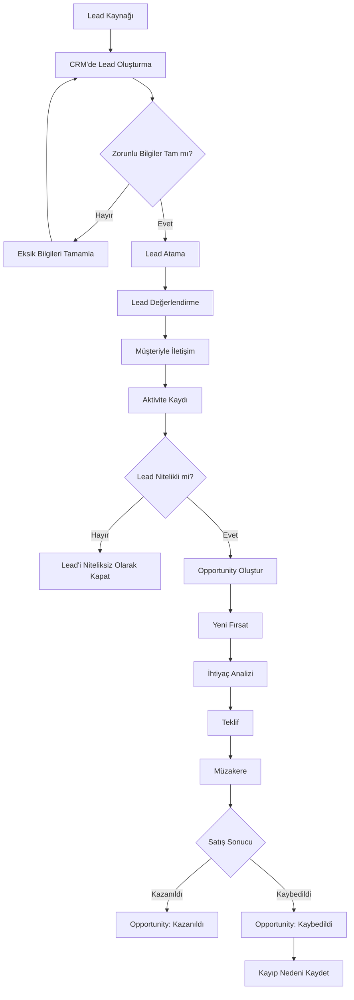
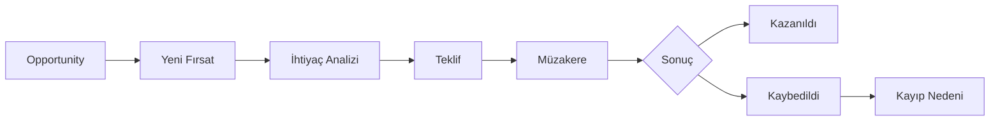
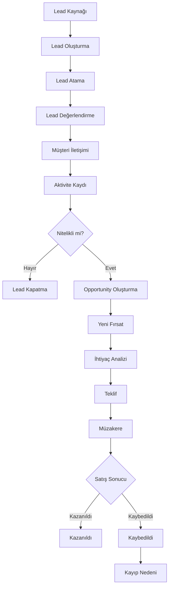

# Process Flow

## 1. Genel Bakış

Bu doküman, CRM sistemindeki Lead ve Opportunity süreçlerinin uçtan uca akışını göstermektedir.

Süreç:

**Lead Oluşturma → Lead Değerlendirme → Nitelendirme → Opportunity Oluşturma → Sales Pipeline → Satış Sonucu**

---

# 2. TO-BE Process Flow



---

# 3. Süreç Adımlarının Açıklaması

## 3.1 Lead Kaynağı

Süreç, potansiyel müşterinin şirketle iletişime geçmesiyle başlar.

Örnek kaynaklar:

* Web sitesi
* E-posta
* Telefon
* Sosyal medya
* Referans
* Etkinlik

---

## 3.2 CRM'de Lead Oluşturma

Potansiyel müşteri CRM içerisinde Lead olarak oluşturulur.

Temel bilgiler sisteme girilir:

* Ad Soyad
* Şirket
* E-posta
* Telefon
* Lead Kaynağı
* Sorumlu kişi

---

## 3.3 Zorunlu Alan Kontrolü

Sistem, Lead oluşturulmadan önce gerekli alanların doldurulup doldurulmadığını kontrol eder.

### Bilgiler eksikse

Kullanıcı eksik alanları tamamlar.

### Bilgiler tamamsa

Lead oluşturma sürecinin sonraki adımına geçilir.

Bu kontrol, veri kalitesinin korunması için kullanılır.

---

## 3.4 Lead Atama

Lead bir satış temsilcisine atanır.

Atama sonrasında ilgili satış temsilcisi Lead'in takibinden sorumlu olur.

---

## 3.5 Lead Değerlendirme

Satış temsilcisi Lead'i inceler.

Müşterinin:

* İhtiyacı
* İlgisi
* Satın alma potansiyeli
* İletişim durumu

değerlendirilir.

---

## 3.6 Müşteriyle İletişim

Satış temsilcisi Lead ile iletişim kurar.

Görüşme sonucunda elde edilen bilgiler CRM'e aktarılır.

---

## 3.7 Aktivite Kaydı

Gerçekleştirilen iletişim CRM üzerinde aktivite olarak kaydedilir.

Örneğin:

* Telefon
* E-posta
* Toplantı
* Not

Bu kayıt, Lead'in geçmişinin takip edilmesini sağlar.

---

# 4. Decision Point — Lead Nitelikli mi?

Bu süreçte önemli bir karar noktası bulunmaktadır.

```text id="v4z8q2"
              Lead Değerlendirme
                     ↓
              Lead nitelikli mi?
                 ↙       ↘
              Hayır       Evet
                ↓           ↓
          Lead Kapatma   Opportunity
                           Oluştur
```

### Hayır

Lead satış fırsatına dönüşmeye uygun değilse kapatılır.

### Evet

Lead satış potansiyeline sahipse Opportunity oluşturulur.

---

# 5. Opportunity Süreci

Nitelikli Lead Opportunity'ye dönüştürüldükten sonra satış süreci başlar.



---

# 6. Sales Pipeline Akışı

Opportunity'nin temel pipeline akışı:

**Yeni Fırsat**

↓

**İhtiyaç Analizi**

↓

**Teklif**

↓

**Müzakere**

↓

**Kazanıldı / Kaybedildi**

Her aşama Opportunity'nin satış sürecindeki mevcut durumunu temsil eder.

---

# 7. End-to-End Process

Lead'den satış sonucuna kadar tüm sürecin birleşik görünümü:



---

# 8. Process Flow'daki Aktörler

Süreçte farklı kullanıcıların farklı sorumlulukları bulunmaktadır.

| Aktör                | Süreçteki Rolü                                                    |
| -------------------- | ----------------------------------------------------------------- |
| Marketing Team       | Lead oluşturulmasına kaynak sağlar                                |
| Sales Representative | Lead'i değerlendirir, iletişim kurar ve Opportunity'yi takip eder |
| Sales Manager        | Lead ve Opportunity süreçlerini izler                             |
| CRM Administrator    | Kullanıcı ve sistem yetkilerini yönetir                           |
| CRM System           | Kayıt, durum, aktivite ve süreç bilgilerinin tutulmasını sağlar   |

---

# 9. Business Analyst Açısından Process Flow

Business Analyst process flow oluştururken aşağıdaki noktaları netleştirir:

### Başlangıç

Süreç nerede başlıyor?

> Lead'in sisteme gelmesi.

### Aktiviteler

Kullanıcı hangi işlemleri gerçekleştiriyor?

> Lead oluşturma, değerlendirme, iletişim, aktivite kaydı, Opportunity oluşturma.

### Karar Noktaları

Süreçte hangi kararlar veriliyor?

> Lead nitelikli mi?

> Satış gerçekleşti mi?

### Çıkış

Süreç nasıl sonlanıyor?

> Lead kapatılır, Opportunity kazanılır veya kaybedilir.

---

# 10. Process Flow'dan Gereksinime Geçiş

Process flow yalnızca görsel bir doküman değildir.

Akış içerisindeki her adım yeni gereksinimler ortaya çıkarabilir.

Örneğin:

### Process Adımı

**Lead Oluşturma**

↓

### Gereksinim

Sistem kullanıcıların Lead oluşturabilmesini sağlamalıdır.

---

### Process Adımı

**Zorunlu Bilgi Kontrolü**

↓

### Gereksinim

Sistem zorunlu alanlar tamamlanmadan Lead kaydının oluşturulmasına izin vermemelidir.

---

### Process Adımı

**Lead Nitelendirme**

↓

### Gereksinim

Sistem Lead'in nitelikli veya niteliksiz olarak işaretlenmesini sağlamalıdır.

---

### Process Adımı

**Opportunity Oluşturma**

↓

### Gereksinim

Sistem nitelikli Lead'in Opportunity'ye dönüştürülmesini sağlamalıdır.

---

# 11. Process Flow Sonucu

Bu process flow ile CRM satış sürecinin uçtan uca yapısı ortaya konmuştur:

**Lead**

→ **Değerlendirme**

→ **Nitelendirme**

→ **Opportunity**

→ **Sales Pipeline**

→ **Kazanıldı / Kaybedildi**

Bu akış, sonraki aşamalarda oluşturulacak **Business Rules, User Stories, Acceptance Criteria ve Test Scenarios** için temel oluşturacaktır.
