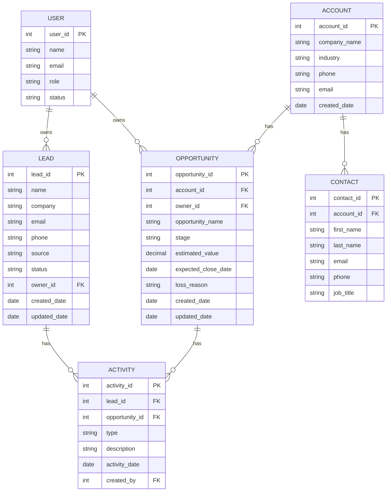

# CRM Data Model

## 1. Amaç

Bu doküman, CRM sisteminde kullanılan temel verilerin ve bu veriler arasındaki ilişkilerin tanımlanması amacıyla hazırlanmıştır.

Data Model ile aşağıdaki sorulara cevap verilmesi amaçlanmaktadır:

* Hangi bilgiler sistemde tutulacak?
* Bu bilgiler hangi varlıklara ait?
* Varlıklar birbiriyle nasıl ilişkilendirilecek?
* Bir Lead veya Opportunity hangi bilgilerle takip edilecek?

---

# 2. Temel CRM Varlıkları

Bu projede aşağıdaki temel varlıklar kullanılmaktadır:

* Lead
* Account
* Contact
* Opportunity
* Activity
* User

---

# 3. Lead

**Lead**, henüz kesinleşmiş bir satış fırsatına dönüşmemiş potansiyel müşteri kaydıdır.

Örneğin:

> Web sitesi üzerinden şirketinizle iletişime geçen bir firma.

### Lead Alanları

| Alan         | Açıklama                   |
| ------------ | -------------------------- |
| Lead ID      | Lead'in benzersiz numarası |
| Name         | Lead adı                   |
| Company      | Şirket adı                 |
| Email        | E-posta adresi             |
| Phone        | Telefon numarası           |
| Lead Source  | Lead'in geldiği kaynak     |
| Status       | Lead'in mevcut durumu      |
| Owner ID     | Lead'den sorumlu kullanıcı |
| Created Date | Oluşturulma tarihi         |
| Updated Date | Son güncelleme tarihi      |

### Örnek

| Lead ID | Name         | Company  | Source   | Status    |
| ------- | ------------ | -------- | -------- | --------- |
| L-001   | Ahmet Yılmaz | ABC Ltd. | Website  | Qualified |
| L-002   | Elif Kaya    | XYZ A.Ş. | Referral | Contacted |

---

# 4. Account

**Account**, müşteri veya potansiyel müşterinin şirket/kurum bilgisini temsil eder.

Örneğin:

> ABC Ltd.

Bir şirketin birden fazla Contact ve Opportunity kaydı olabilir.

### Account Alanları

| Alan         | Açıklama                    |
| ------------ | --------------------------- |
| Account ID   | Şirketin benzersiz numarası |
| Company Name | Şirket adı                  |
| Industry     | Sektör                      |
| Phone        | Şirket telefonu             |
| Email        | Şirket e-postası            |
| Created Date | Oluşturulma tarihi          |

---

# 5. Contact

**Contact**, Account içerisinde iletişim kurulan kişiyi temsil eder.

Örneğin:

> ABC Ltd. şirketindeki Satın Alma Müdürü Ahmet Yılmaz.

### Contact Alanları

| Alan       | Açıklama                   |
| ---------- | -------------------------- |
| Contact ID | Kişinin benzersiz numarası |
| Account ID | Bağlı olduğu şirket        |
| First Name | Ad                         |
| Last Name  | Soyad                      |
| Email      | E-posta                    |
| Phone      | Telefon                    |
| Job Title  | Pozisyon                   |

### Örnek

**Account:**

> ABC Ltd.

**Contact:**

> Ahmet Yılmaz — Satın Alma Müdürü

---

# 6. Opportunity

**Opportunity**, satışa dönüşme potansiyeli bulunan somut satış fırsatıdır.

Lead'den farklı olarak Opportunity, satış sürecinin daha ileri aşamasındadır.

Örneğin:

> ABC Ltd. şirketinin 500.000 TL değerindeki yazılım satın alma fırsatı.

### Opportunity Alanları

| Alan                | Açıklama                    |
| ------------------- | --------------------------- |
| Opportunity ID      | Fırsatın benzersiz numarası |
| Account ID          | İlgili şirket               |
| Opportunity Name    | Fırsat adı                  |
| Owner ID            | Fırsattan sorumlu kullanıcı |
| Stage               | Satış aşaması               |
| Estimated Value     | Tahmini satış değeri        |
| Expected Close Date | Beklenen kapanış tarihi     |
| Loss Reason         | Kayıp nedeni                |
| Created Date        | Oluşturulma tarihi          |
| Updated Date        | Son güncelleme tarihi       |

---

# 7. Activity

**Activity**, Lead veya Opportunity ile ilgili gerçekleştirilen iletişim ve takip işlemlerini temsil eder.

Örneğin:

* Telefon görüşmesi
* E-posta
* Toplantı
* Not

### Activity Alanları

| Alan           | Açıklama                       |
| -------------- | ------------------------------ |
| Activity ID    | Aktivitenin benzersiz numarası |
| Lead ID        | İlgili Lead                    |
| Opportunity ID | İlgili Opportunity             |
| Type           | Aktivite türü                  |
| Description    | Aktivite açıklaması            |
| Activity Date  | Aktivite tarihi                |
| Created By     | Aktiviteyi oluşturan kullanıcı |

> Bir Activity, Lead veya Opportunity ile ilişkili olmalıdır.

---

# 8. User

**User**, CRM sistemini kullanan çalışanları temsil eder.

Örneğin:

* Sales Representative
* Sales Manager
* CRM Administrator

### User Alanları

| Alan    | Açıklama                        |
| ------- | ------------------------------- |
| User ID | Kullanıcının benzersiz numarası |
| Name    | Kullanıcı adı                   |
| Email   | Kullanıcı e-postası             |
| Role    | Kullanıcı rolü                  |
| Status  | Aktif/Pasif durumu              |

---

# 9. Varlıklar Arasındaki İlişkiler

Temel ilişkiler aşağıdaki şekildedir:

### Lead → User

Bir Lead'in bir sorumlusu vardır.

> Lead → Owner

Örneğin:

> L-001 → User-05

---

### Account → Contact

Bir Account'un birden fazla Contact kaydı olabilir.

> Account 1 → N Contact

Örneğin:

> ABC Ltd. → Ahmet Yılmaz
> ABC Ltd. → Ayşe Demir

---

### Account → Opportunity

Bir Account'un birden fazla Opportunity kaydı olabilir.

> Account 1 → N Opportunity

Örneğin:

> ABC Ltd. → Yazılım Projesi
> ABC Ltd. → Mobil Uygulama Projesi

---

### User → Opportunity

Bir Sales Representative birden fazla Opportunity'den sorumlu olabilir.

> User 1 → N Opportunity

---

### Lead → Activity

Bir Lead'in birden fazla aktivitesi olabilir.

> Lead 1 → N Activity

---

### Opportunity → Activity

Bir Opportunity'nin birden fazla aktivitesi olabilir.

> Opportunity 1 → N Activity

---

# 10. Basit Veri İlişkisi

Genel yapı:

```text
Lead
  │
  │ Qualified
  ▼
Opportunity
  │
  ├── Account
  │     │
  │     └── Contact
  │
  └── Activity

Lead
  │
  └── Activity

User
  ├── Lead Owner
  └── Opportunity Owner
```

---

# 11. Mermaid ERD



---

# 12. Primary Key ve Foreign Key

Bu projede veri ilişkilerini kurarken iki temel kavram kullanılmaktadır.

### Primary Key (PK)

Bir kaydı sistem içerisinde benzersiz şekilde tanımlar.

Örneğin:

```text
LEAD
Lead ID = L-001
```

Başka bir Lead aynı ID'ye sahip olmamalıdır.

---

### Foreign Key (FK)

Bir tablonun başka bir tabloyla ilişki kurmasını sağlar.

Örneğin:

```text
OPPORTUNITY
Account ID = A-001
```

Buradaki `Account ID`, Opportunity'nin hangi Account'a ait olduğunu gösterir.

---

# 13. Örnek Veri İlişkisi

Örneğin CRM'de aşağıdaki kayıtlar bulunmaktadır:

### Account

```text
Account ID: A-001
Company: ABC Ltd.
```

### Contact

```text
Contact ID: C-001
Account ID: A-001
Name: Ahmet Yılmaz
```

### Opportunity

```text
Opportunity ID: O-001
Account ID: A-001
Opportunity Name: ERP Projesi
Estimated Value: 500000
Stage: Proposal
```

### Activity

```text
Activity ID: ACT-001
Opportunity ID: O-001
Type: Meeting
Description: Ürün sunumu gerçekleştirildi.
```

Bu durumda:

```text
ABC Ltd.
   │
   ├── Ahmet Yılmaz
   │
   └── ERP Projesi
          │
          └── Meeting Activity
```

şeklinde bir ilişki oluşur.

---

# 14. Lead ve Opportunity Farkı

| Özellik       | Lead                                       | Opportunity          |
| ------------- | ------------------------------------------ | -------------------- |
| Anlamı        | Potansiyel müşteri                         | Somut satış fırsatı  |
| Satış aşaması | İlk aşama                                  | Daha ileri aşama     |
| Pipeline      | Hayır                                      | Evet                 |
| Tahmini değer | Zorunlu değil                              | Takip edilir         |
| Stage         | Lead Status                                | Opportunity Stage    |
| Dönüşüm       | Opportunity'ye dönüşebilir                 | Satış sonucuna gider |
| Sonuç         | Qualified / Unqualified / Converted / Lost | Won / Lost           |

---

# 15. BA Açısından Veri Modelinin Önemi

Business Analyst açısından Data Model'in amacı yalnızca veritabanı oluşturmak değildir.

BA şu soruların cevabını anlamalıdır:

* Hangi bilgi tutulmalı?
* Bu bilgi hangi varlığa ait?
* Hangi kayıt başka bir kayıtla ilişkili?
* Bir şirketin kaç Opportunity'si olabilir?
* Bir Opportunity'nin sorumlusu kim?
* Activity hangi kayıtla ilişkili?
* Hangi alan zorunlu?
* Hangi bilgiler benzersiz olmalı?

Bu sorular daha sonra:

**Requirements → Data Model → SQL → Test**

ilişkisini kurmamıza yardımcı olur.

---

# 16. Proje Veri Akışı

CRM projesindeki temel veri akışı:

```text
Lead
  ↓
Lead Evaluation
  ↓
Qualified
  ↓
Opportunity
  ↓
Sales Pipeline
  ↓
Won / Lost
```

İletişim ve takip bilgileri ise:

```text
Lead ──────→ Activity
Opportunity ─→ Activity
```

şeklinde tutulur.

---

# 17. Özet

Bu veri modelinde CRM sisteminin temel yapı taşları:

* **Lead:** Potansiyel müşteri
* **Account:** Şirket/kurum
* **Contact:** Şirket içerisindeki kişi
* **Opportunity:** Satış fırsatı
* **Activity:** İletişim ve takip kaydı
* **User:** CRM kullanıcısı

olarak tanımlanmıştır.

Bu yapı, sonraki aşamada SQL sorgularının oluşturulması için temel oluşturur.
